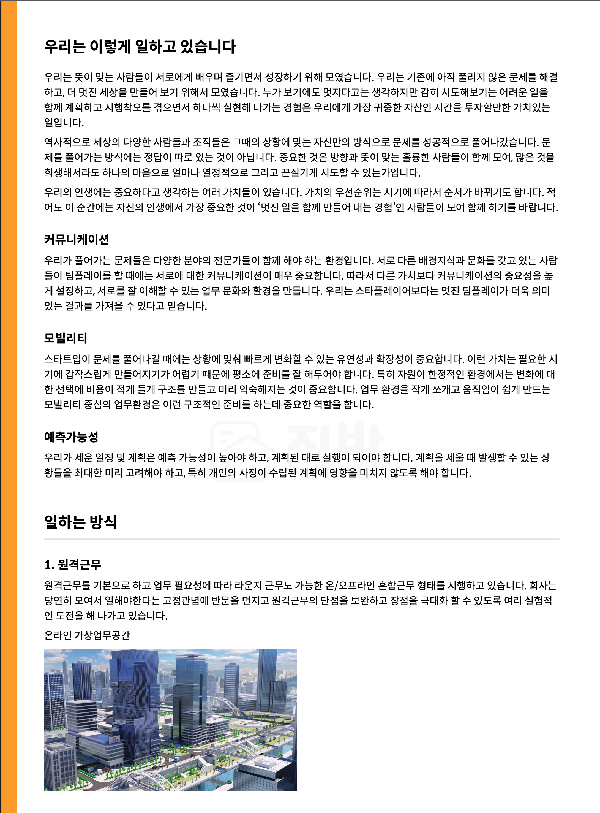
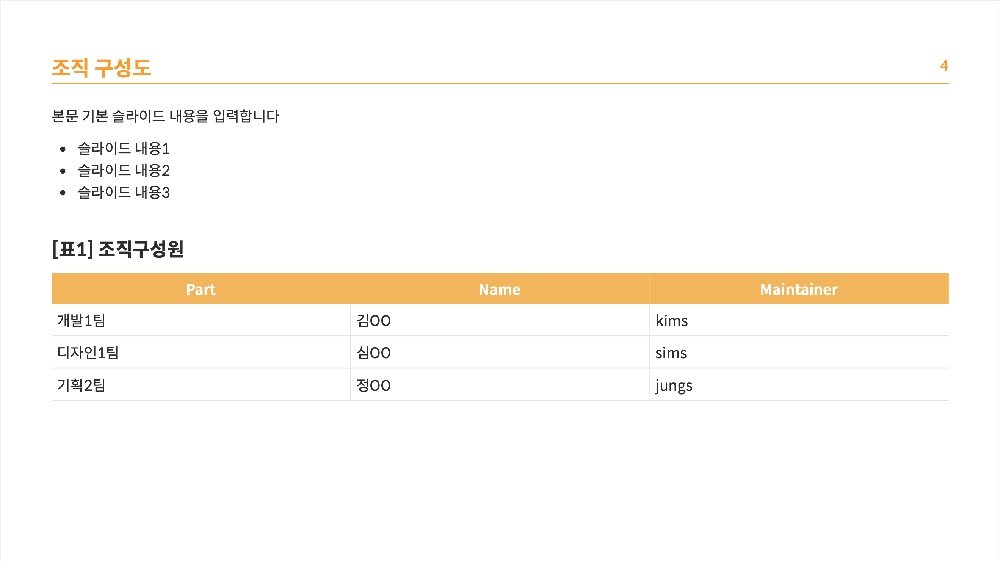
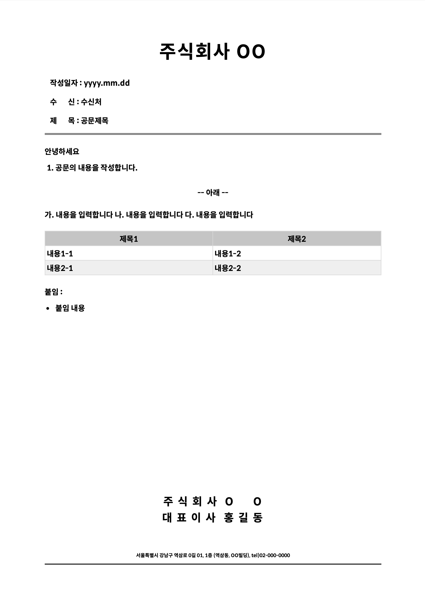
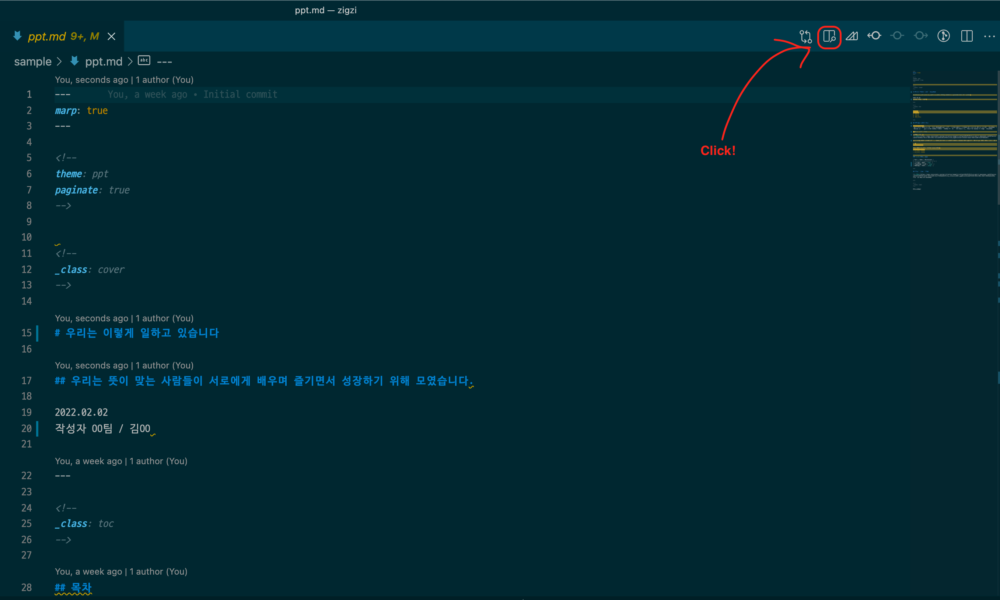
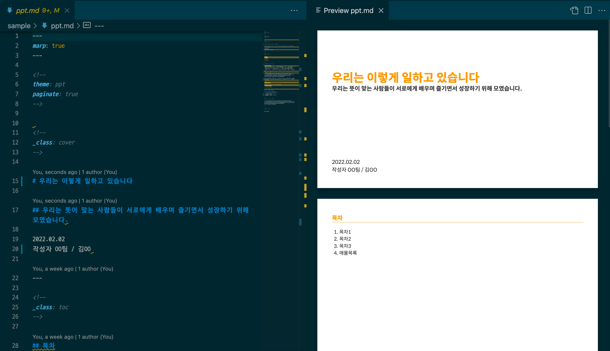

# ZIGZI (直指)

ZIGZI는 사내에서 Markdown으로 작성한 문서에 미리 디자인된 템플릿을 적용하여 규격화된 문서를 간편하고 빠르게 생성할 수 있는 도구입니다.
용도에 따라 프레젠테이션용 문서인 `zb_ppt`, 워드 문서인 `zb_doc`, 그리고 여러 공공기관에 필요한 공문 `zb_official`의 템플릿을 선택할 수 있습니다.

|`zb_doc`|`zb_ppt`|`zb_official`|
|:-:|:-:|:-:|
|||

## Usage

### npx
```sh
npx zigzi <target file.md> --template=zb_doc
```

## Supported Options
ZIGZI는 다음 두 가지의 옵션을 재공합니다.

* `--template` - 문서의 템플릿 지정합니다. (default: `zb_doc`) 
  * `zb_ppt` - PPT 문서 (예: 기획 시나리오 작성, PT 용)
  * `zb_doc` - DOC 문서 (예: 기술 문서 작성)
  * `zb_official` - 공문서 
* `--output` - 생성할 문서의 포맷 (`pdf`, `html`)을 지정합니다. (default: `pdf`)


***

## VSCode에서 Preview 보기
아래의 VS Code Extension을 설치하면, 현재 작성중인 MD 파일에 CSS가 적용된 Preview 화면을 볼 수가 있습니다.
1. VS Code의 Extension 탭에서 [`Marp for VS Code`](https://marketplace.visualstudio.com/items?itemName=marp-team.marp-vscode) 검색하여 설치합니다.
2. VS Code에서 `CMD + ,`를 눌러서 marp를 검색하여 아래의 옵션을 찾습니다.
3. `Markdown > Marp: Themes` 옵션에 아래 css 링크들을 추가하면, VS Code Editor에서 Preview를 볼 수 있습니다.
  - https://zigbang.github.io/zigzi/asset/ppt.css
  - https://zigbang.github.io/zigzi/asset/ppt-large.css
  - https://zigbang.github.io/zigzi/asset/doc.css
  - https://zigbang.github.io/zigzi/asset/official.css

|Preview 클릭|Preview 화면|
|:-:|:-:|
||
